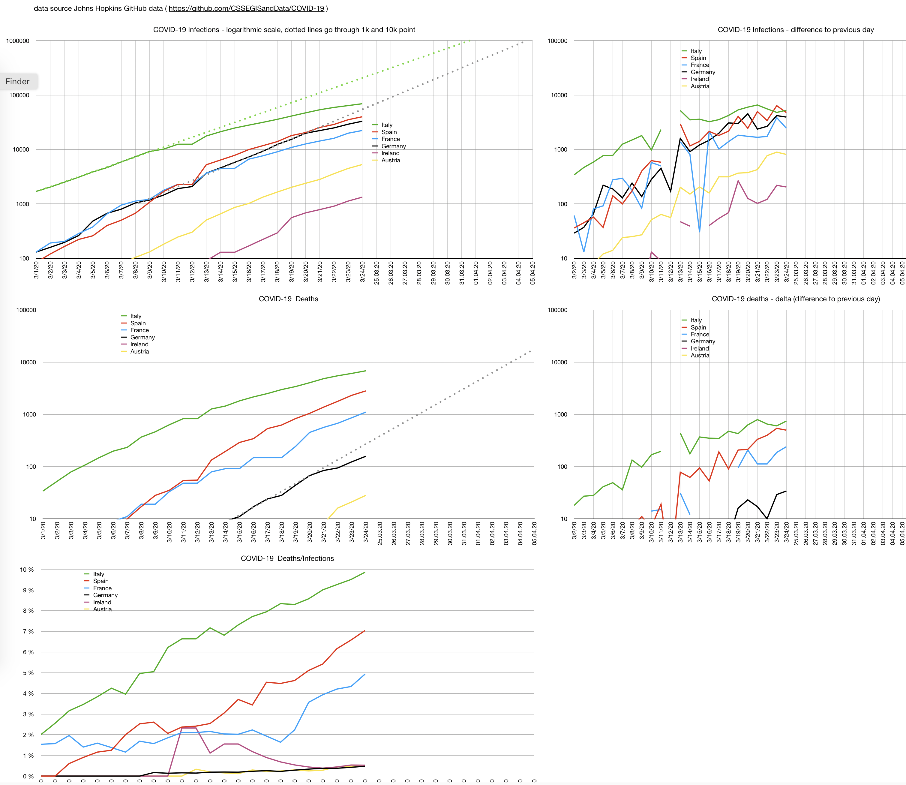

COVID-19 numbers spreadsheet
----------------------------------------------

This is a numbers spreadsheet to visualize johnshopkins data.
It shows me the numbers I don't see in mass media: 

- delta deaths per day per country
- delta infections per day per country
- new infections in relation to current infections
- deathrate in percent ( quite useless if you don't know how many get tested)

 
