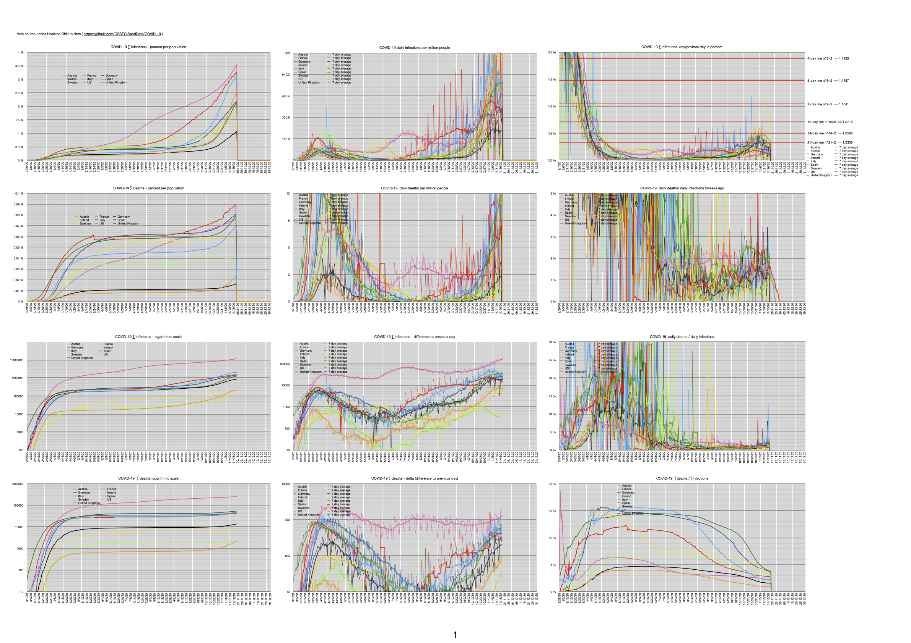

COVID-19 numbers spreadsheet
----------------------------------------------

This is a numbers spreadsheet to visualize johnshopkins data.
It shows me the numbers I don't see in mass media: 

- delta infections and deaths per population per day (how many people per million get infected/die per day)
- delta infections and deaths per day per country log scale
- infections and deaths in regards of population of that country
- new infections/deaths in relation to current infections
- duplication lines
- deathrate in percent ( quite useless if you don't know how many get tested)

